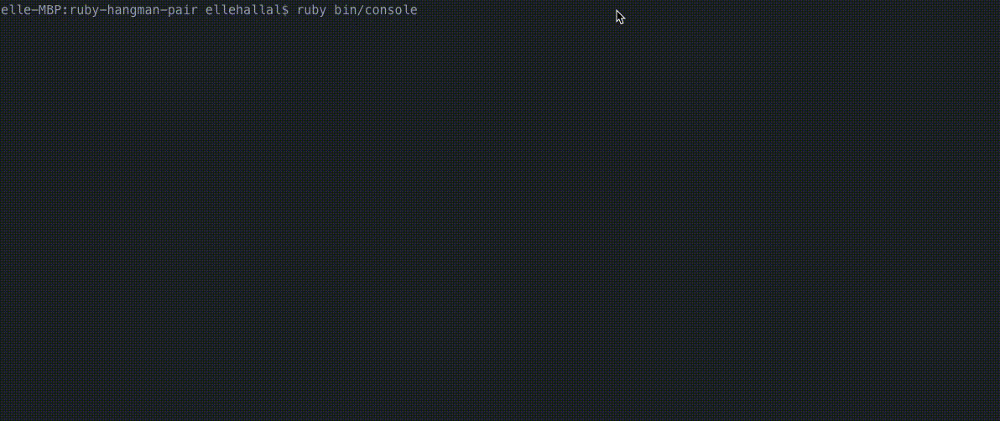

# Ruby Hangman

A command line Hangman game, created with [Ruby](https://www.ruby-lang.org/en/). Made by [@backslashbaker](https://github.com/backslashbaker) & [@itsellej](https://github.com/itsellej).

- [Ruby Hangman](#ruby-hangman)
  - [Preview](#preview)
  - [Requirements](#requirements)
  - [Install](#install)
  - [Testing](#testing)
      - [Running Tests](#running-tests)
  - [Edge cases considered](#edge-cases-considered)
  - [Related Blog Posts](#related-blog-posts)

## Preview



## Requirements

- The user should be greeted by a message
- The user has a fixed number of guesses
- The user can choose to play again
- Letters guessed correctly and incorrectly should be displayed
- Displays if the user has won or lost
- Computer picks a random word

## Install

Note: if you don't have Ruby installed, you can find instructions [here](https://www.ruby-lang.org/en/documentation/installation/).

In the terminal, type:

```
git clone https://github.com/itsellej/ruby-hangman-pair.git
cd ruby-hangman-pair
ruby bin/console
```

## Testing

All classes are tested using [RSpec](http://rspec.info/).

#### Running Tests

To run all tests, in the terminal, type:
`rspec`

To run tests for individual classes:
`rspec spec/[name of test file]`

## Edge cases considered

- If the user enters more than a single letter, they're prompted to try again and their number of guesses remains the same.
- If the user inputs a letter that has already been guessed, they're prompted to try again, and their number of guesses remains the same.
- If the user's input is not a-z, A-Z or ', they're prompted to try again. Their number of guesses remains the same.

## Related Blog Posts
Blog post published to [Medium](https://medium.com/@ellehallal) during the creation of Hangman:
- [More TDD, Hangman & Self Care](https://medium.com/@ellehallal/week-3-more-tdd-classes-in-ruby-self-care-5d961d7380b3)


